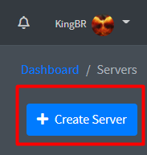

# Host dedicada

Existe vários serviços de hosts dedicadas que podem ser usados, nesse guia usaremos [YeetHosting**™**](https://yeeth.mindustry.me/login)** **um serviço grátis e fácil de usar

Primeiro de tudo você precisará criar uma conta [aqui](https://yeeth.mindustry.me/register)


Verifique seu email e conecte sua conta com o discord antes de prosseguir


Depois de criado a conta você verá sua dashboard

.png>)

Aperte em _**Servers**_ no menu do lado esquerdo e depois em _**Create Server**_ no canto direito superior

.png>)

Dê um nome e descrição para o servidor a sua escolha e configure o resto de acordo com a imagem

.png>)


Caso aparece o erro da imagem abaixo, isso significa que o serviço não possui hosts livres no momento. Entre no [discord oficial](https://discord.gg/2gWJhv3pNZ) do serviço e peça a um dos administradores para liberar um espaço para você. Eles não deixam todas as host disponíveis para evitar que um único usuário pegue todas de uma vez

.png>)


Depois de criado, o server aparecerá no menu _**Servers**_. Aperte em _**Manage**_ para entrar no painel de configuração do servidor

.png>)

Faça login no painel usando a mesma conta que foi criada no começo desse guia

.png>)

Selecione o servidor que deseja configurar

.png>)

Esse é seu painel de configuração do servidor. Para inicia-lo aperte em _**START **_no canto direito superior e espere alguns segundos

.png>)

Quando o servidor terminar de iniciar o console aparecerá mais ou menos assim. Caso queira usar algum comando do servidor você pode usa-lo por aqui

.png>)


**Dica**! o IP do seu servidor aparece no lado direito do console, logo em cima das estatísticas da host

.png>)



Pronto! o servidor está ligado e pronto para jogar, mande o IP para seus amigos para que eles consigam entrar no servidor e se divirtam!

