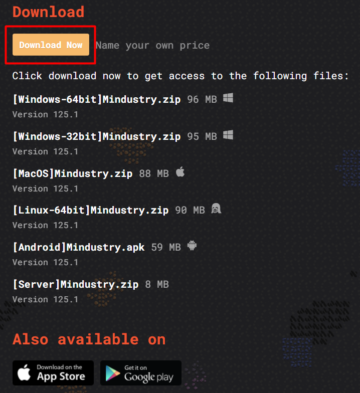
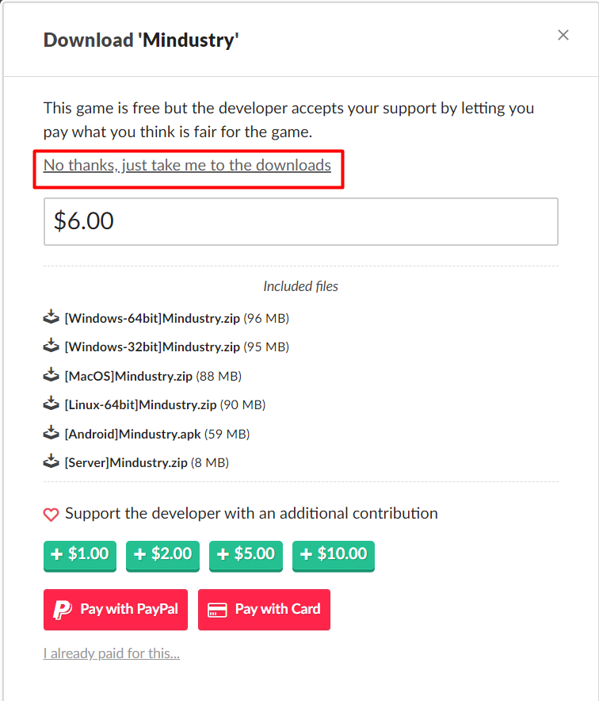
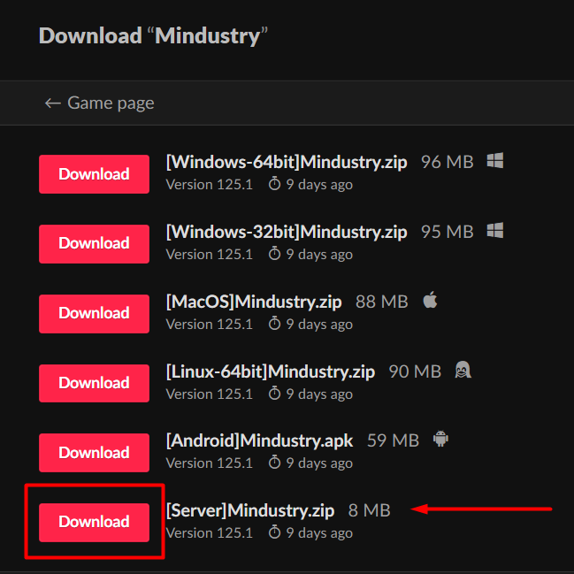
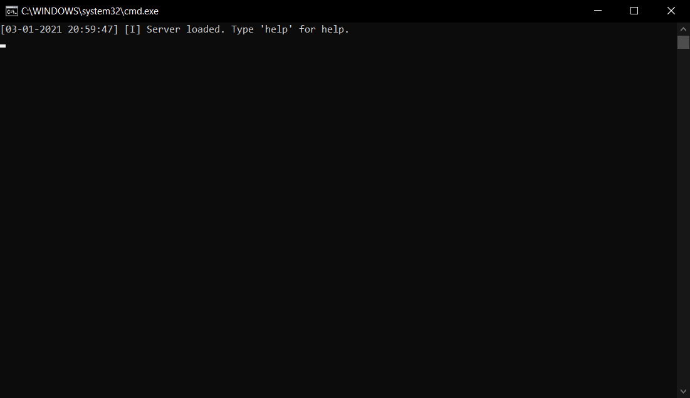

# PC

Aqui você vera um guia passo a passo de como hostear um server no PC

## Passos

* Baixe e instale o JDK 8 ou uma versão mais recente por [aqui](https://adoptopenjdk.net/) ou por sua fonte preferida
* Baixe os arquivos do server na [pagina do Mindustry no itch.io](https://anuke.itch.io/mindustry)







* Abra o explorador de arquivo no local onde você fez o download do arquivo
* Extraia o arquivo ZIP usando uma ferramenta de sua preferência \(Ex: [Winrar](https://www.win-rar.com/start.html?&L=0), [7-zip](https://www.7-zip.org/download.html), etc...\)
* Vá para o local que os arquivos foram extraídos
* Aperte duas vezes em cima do arquivo "run\_server.bat"
* Uma janela do Command Prompt deve aparecer com a seguinte mensagem \(pode demorar alguns segundos para a mensagem aparecer\)




Caso a janela abra e feche imediatamente, verifique se a instalação do JDK foi feita corretamente e se você seguiu todos os passos informados. Caso o problema persista peça ajuda no [server do Discord](https://discord.gg/Rt5HjqW)


* Para abrir o server use o comando host


Ao usar o comando host o server irá ser iniciado em um mapa aleatório no modo survival, caso queira usar um mapa ou modo de jogo específico use o comando como mostrado abaixo

```text
host nome_do_mapa modo_de_jogo
```

O nome do mapa tem que ser em letras minúsculas e substituindo espaços por sublinhados.  
  
Exemplo 1: Iniciar o server no mapa Debris Field no modo survival

```text
host debris_field
```

ou

```text
host debris_field survival
```

Exemplo 2: Iniciar o server no mapa Mud Flats no modo criativo

```text
host mud_flats sandbox
```

Exemplo 3: Iniciar o server no mapa Ancient Caldera no modo PVP

```text
host ancient_caldera pvp
```



Você pode ver a lista de mapas usando o comando maps



